# sadists

[](https://travis-ci.org/shabbychef/sadists)
[](http://codecov.io/github/shabbychef/sadists?branch=master)
[](http://cran.rstudio.com/package=sadists) 
[](http://www.r-pkg.org/pkg/sadists)
[](http://www.r-pkg.org/pkg/sadists)

Some Additional Distributions apparently not available in R.

-- Steven E. Pav, shabbychef@gmail.com

## Installation

This package can be installed from CRAN,
via [drat](https://github.com/eddelbuettel/drat "drat"), or
from [github](https://www.github.com/shabbychef/sadists "sadists"):


```r
# via CRAN:
install.packages("sadists")
# via drat:
if (require(drat)) {
    drat:::add("shabbychef")
    install.packages("sadists")
}
# via devtools (typically 'master' is stable):
if (require(devtools)) {
    install_github("shabbychef/sadists")
}
```

## Testing distributions

First some functions to test the 'dpqr' functions:


```r
testf <- function(dpqr, nobs, ...) {
    require(ggplot2)
    require(grid)
    
    set.seed(3940071)
    rv <- sort(dpqr$r(nobs, ...))
    data <- data.frame(draws = rv, pvals = dpqr$p(rv, 
        ...))
    text.size <- 8  # sigh
    
    # http://stackoverflow.com/a/5688125/164611
    p1 <- qplot(rv, geom = "blank") + geom_line(aes(y = ..density.., 
        colour = "Empirical"), stat = "density") + 
        stat_function(fun = function(x) {
            dpqr$d(x, ...)
        }, aes(colour = "Theoretical")) + geom_histogram(aes(y = ..density..), 
        alpha = 0.3) + scale_colour_manual(name = "Density", 
        values = c("red", "blue")) + theme(text = element_text(size = text.size)) + 
        labs(title = "Density (tests dfunc)")
    
    # Q-Q plot
    p2 <- ggplot(data, aes(sample = draws)) + stat_qq(distribution = function(p) {
        dpqr$q(p, ...)
    }) + geom_abline(slope = 1, intercept = 0, colour = "red") + 
        theme(text = element_text(size = text.size)) + 
        labs(title = "Q-Q plot (tests qfunc)")
    
    # empirical CDF of the p-values; should be uniform
    p3 <- ggplot(data, aes(sample = pvals)) + stat_qq(distribution = qunif) + 
        geom_abline(slope = 1, intercept = 0, colour = "red") + 
        theme(text = element_text(size = text.size)) + 
        labs(title = "P-P plot (tests pfunc)")
    
    # Define grid layout to locate plots and print each
    # graph
    pushViewport(viewport(layout = grid.layout(2, 2)))
    print(p1, vp = viewport(layout.pos.row = 1, layout.pos.col = 1:2))
    print(p2, vp = viewport(layout.pos.row = 2, layout.pos.col = 1))
    print(p3, vp = viewport(layout.pos.row = 2, layout.pos.col = 2))
}
```

## Weighted sum of (non-central) chi-squares to power

This distribution is the weighted sum of independent 
(non-central) chi-square variates taken to some powers.
The special case where the powers are all one half 
is related to the upsilon distribution. The 
special case where the powers are all one could be used
to compute the distribution of the (doubly non-central)
F distribution.


```r
require(sadists)
wts <- c(-1, 1, 3, -3)
df <- c(100, 200, 100, 50)
ncp <- c(0, 1, 0.5, 2)
pow <- c(1, 0.5, 2, 1.5)
testf(list(d = dsumchisqpow, p = psumchisqpow, q = qsumchisqpow, 
    r = rsumchisqpow), nobs = 2^14, wts, df, ncp, pow)
```

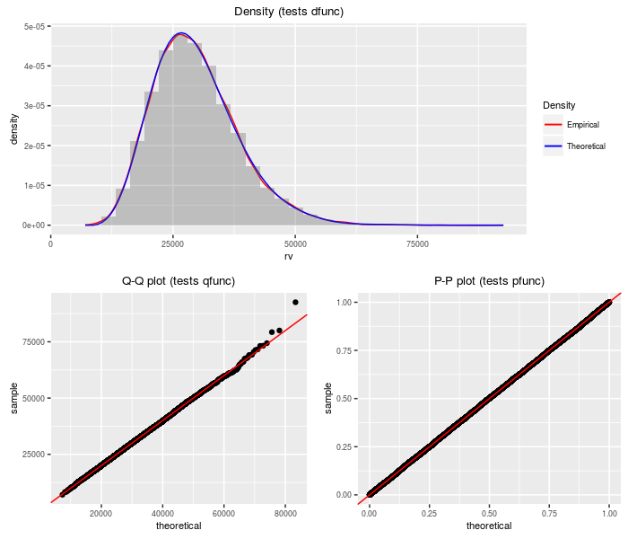


## K-prime distribution

The K-prime distribution is the weighted sum of a standard normal and an independent central chi, 
all divided by another independent central chi. Depending on the degrees of freedom and the weights,
the K-prime can appears as a Lambda-prime, a normal, or a central t.


```r
require(sadists)
v1 <- 50
v2 <- 80
a <- 0.5
b <- 1.5
testf(list(d = dkprime, p = pkprime, q = qkprime, r = rkprime), 
    nobs = 2^14, v1, v2, a, b)
```

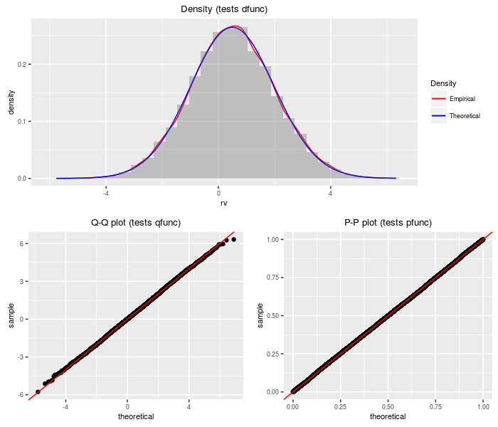

## Lambda prime distribution

A [Lambda prime](http://arxiv.org/abs/1003.4890v1) random variable is the sum of a standard
normal and an independent, scaled central chi random variable.


```r
require(sadists)
df <- 70
ts <- 2
testf(list(d = dlambdap, p = plambdap, q = qlambdap, 
    r = rlambdap), nobs = 2^14, df, ts)
```

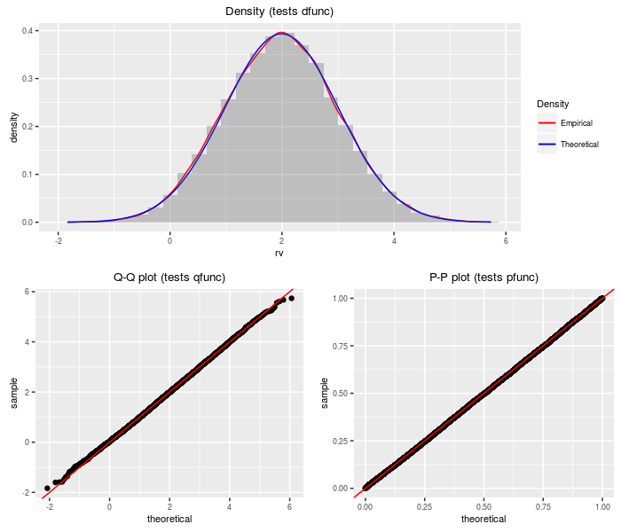

## Upsilon distribution

An upsilon random variable is the sum of a standard
normal and the weighted sum of several indpendent central chis.


```r
require(sadists)
df <- c(30, 50, 100, 20, 10)
ts <- c(-3, 2, 5, -4, 1)
testf(list(d = dupsilon, p = pupsilon, q = qupsilon, 
    r = rupsilon), nobs = 2^14, df, ts)
```


## Doubly non-central t distribution

The [doubly non-central t distribution](http://www.math.wm.edu/~leemis/chart/UDR/PDFs/Doublynoncentralt.pdf)
generalizes the t distribution to the case where the denominator chi-square is non-central.


```r
require(sadists)
df <- 75
ncp1 <- 2
ncp2 <- 3
testf(list(d = ddnt, p = pdnt, q = qdnt, r = rdnt), 
    nobs = 2^14, df, ncp1, ncp2)
```

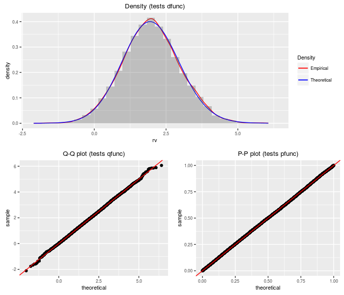

## Doubly non-central F distribution

The doubly non-central F distribution generalizes the F distribution to the case where the denominator
chi-square is non-central. 


```r
require(sadists)
df1 <- 40
df2 <- 80
ncp1 <- 1.5
ncp2 <- 2.5
testf(list(d = ddnf, p = pdnf, q = qdnf, r = rdnf), 
    nobs = 2^14, df1, df2, ncp1, ncp2)
```

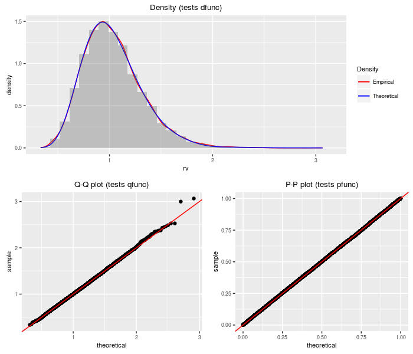

## Doubly non-central Beta distribution

The [doubly non-central Beta distribution](http://www.jstor.org/stable/25051626)
can be viewed as a transformation of the doubly non-central F 
distribution. 


```r
require(sadists)
df1 <- 40
df2 <- 80
ncp1 <- 1.5
ncp2 <- 2.5
testf(list(d = ddnbeta, p = pdnbeta, q = qdnbeta, r = rdnbeta), 
    nobs = 2^14, df1, df2, ncp1, ncp2)
```

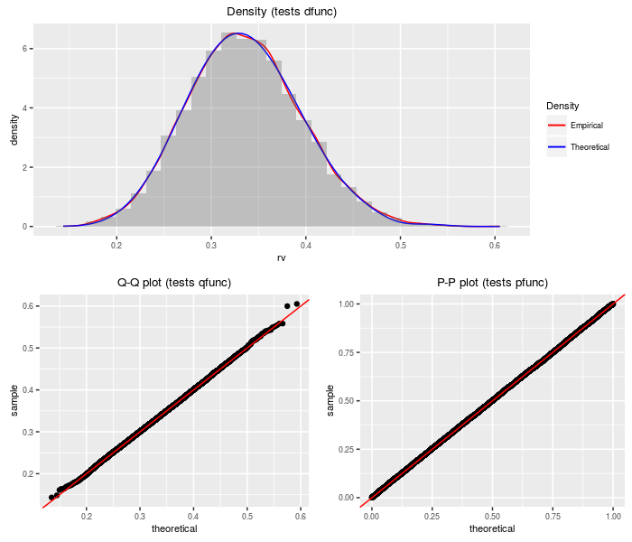

## Doubly non-central Eta distribution

The doubly non-central Eta distribution can be viewed as the square root
of the doubly non-central Beta distribution. It is a transform of the
doubly non-central t distribution.


```r
require(sadists)
df <- 100
ncp1 <- 0.5
ncp2 <- 2.5
testf(list(d = ddneta, p = pdneta, q = qdneta, r = rdneta), 
    nobs = 2^14, df, ncp1, ncp2)
```

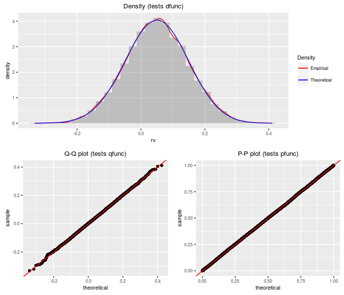

## Weighted sum of logs of (non-central) chi-squares 

This distribution is the weighted sum of logs of independent 
(non-central) chi-square variates.


```r
require(sadists)
wts <- c(5, -4, 10, -15)
df <- c(100, 200, 100, 50)
ncp <- c(0, 1, 0.5, 2)
testf(list(d = dsumlogchisq, p = psumlogchisq, q = qsumlogchisq, 
    r = rsumlogchisq), nobs = 2^14, wts, df, ncp)
```

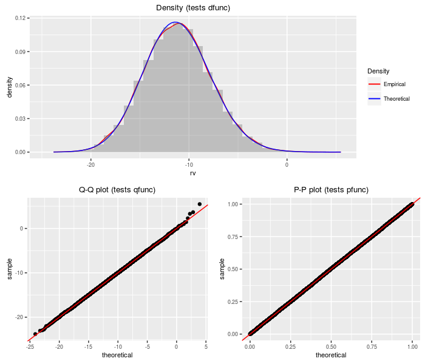

## Product of doubly non-central F variates

This distribution is the product of independent 
doubly non-central F variates.
The PDQ functions are computed by 
transformation on the sum of log chi-squares distribution.


```r
require(sadists)
df1 <- c(10, 20, 5)
df2 <- c(1000, 500, 150)
ncp1 <- c(1, 0, 2.5)
ncp2 <- c(0, 1.5, 5)
testf(list(d = dproddnf, p = pproddnf, q = qproddnf, 
    r = rproddnf), nobs = 2^14, df1, df2, ncp1, ncp2)
```

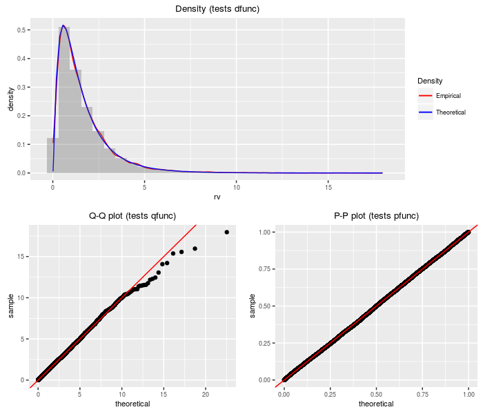

## Product of (non-central) chi-squares to power

This distribution is the product of independent 
(non-central) chi-square variates taken to some powers. 
The PDQ functions are computed by 
transformation on the sum of log chi-squares distribution.


```r
require(sadists)
df <- c(100, 200, 100, 50)
ncp <- c(0, 1, 0.5, 2)
pow <- c(1, 0.5, 2, 1.5)
testf(list(d = dprodchisqpow, p = pprodchisqpow, q = qprodchisqpow, 
    r = rprodchisqpow), nobs = 2^14, df, ncp, pow)
```

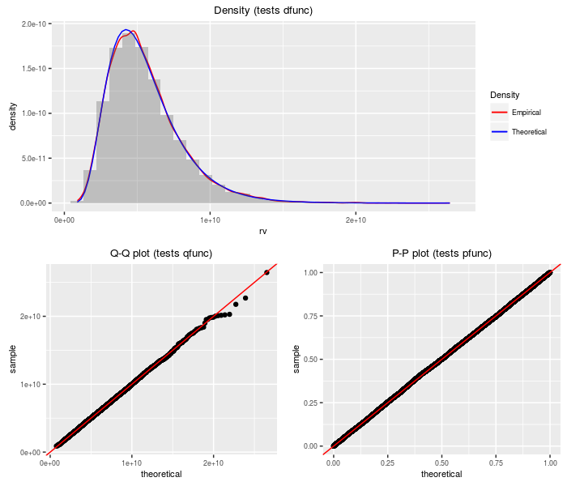

## Product of independent normals

This distribution is the product of independent 
normal variates. Warning: when the coefficient of variation is
large for some of the factors, this approximation can be _terrible_.


```r
require(sadists)
mu <- c(100, -50, -10)
sigma <- c(10, 5, 10)
testf(list(d = dprodnormal, p = pprodnormal, q = qprodnormal, 
    r = rprodnormal), nobs = 2^14, mu, sigma)
```

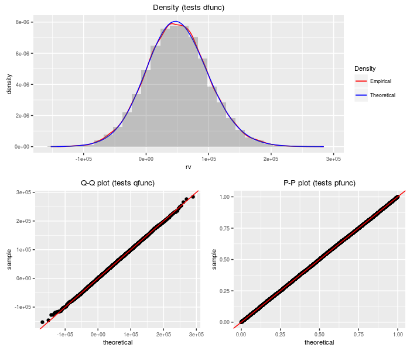

