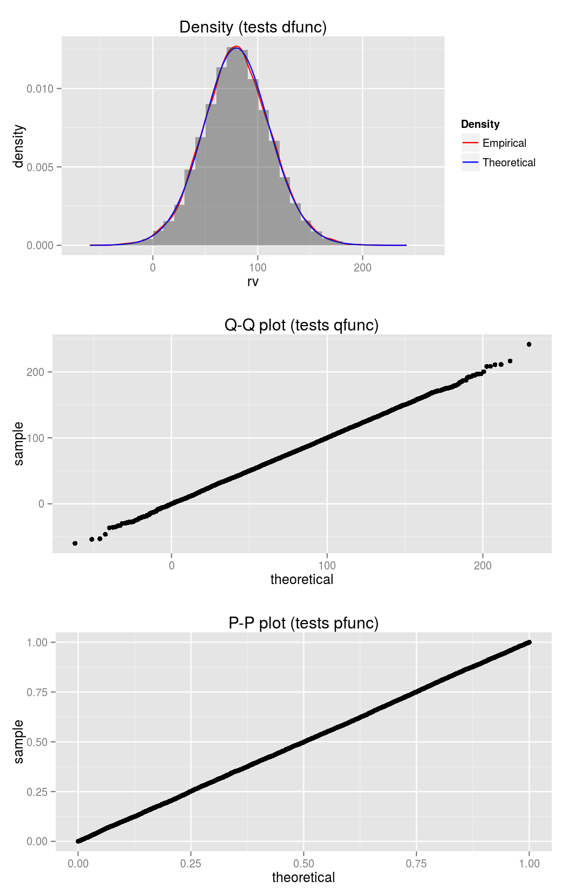
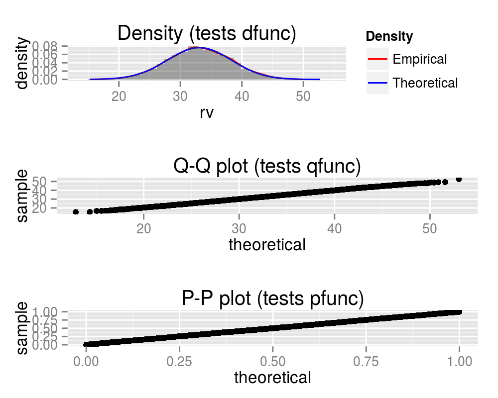
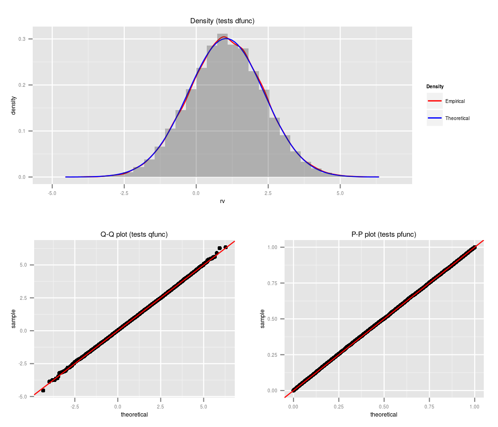
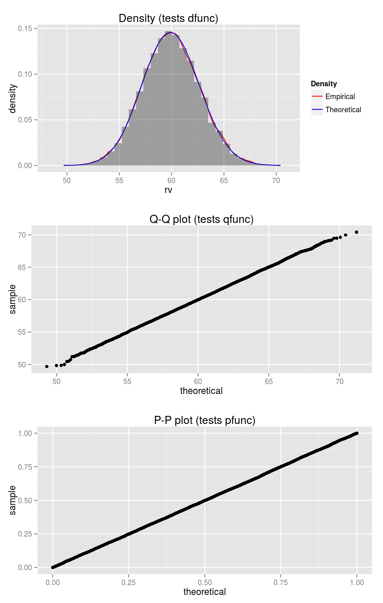
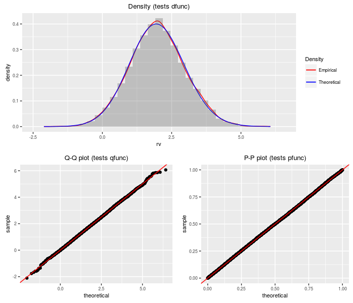
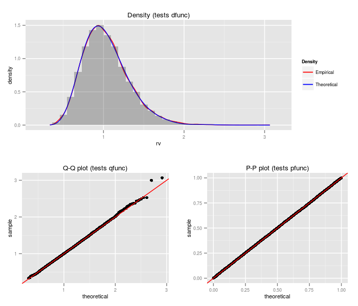

# sadists

[](https://travis-ci.org/shabbychef/sadists)

Some Additional Distributions apparently not available in R.

-- Steven E. Pav, shabbychef@gmail.com

## Installation

This package may be installed from CRAN; the latest version may be
found on [github](https://www.github.com/shabbychef/sadists "sadists")
via devtools, or installed via [drat](https://github.com/eddelbuettel/drat "drat"):


```r
if (require(devtools)) {
    # latest greatest
    install_github("shabbychef/sadists")
}
# via drat:
if (require(drat)) {
    drat:::add("shabbychef")
    install.packages("sadists")
}
```

## Testing distributions

First some functions to test the 'dpqr' functions:


```r
require(ggplot2)
# from:
# http://www.cookbook-r.com/Graphs/Multiple_graphs_on_one_page_(ggplot2)/
# Multiple plot function ggplot objects can be
# passed in ..., or to plotlist (as a list of
# ggplot objects) - cols: Number of columns in
# layout - layout: A matrix specifying the layout.
# If present, 'cols' is ignored.  If the layout is
# something like matrix(c(1,2,3,3), nrow=2,
# byrow=TRUE), then plot 1 will go in the upper
# left, 2 will go in the upper right, and 3 will go
# all the way across the bottom.
multiplot <- function(..., plotlist = NULL, file, cols = 1, 
    layout = NULL) {
    require(grid)
    
    # Make a list from the ... arguments and plotlist
    plots <- c(list(...), plotlist)
    
    numPlots = length(plots)
    
    # If layout is NULL, then use 'cols' to determine
    # layout
    if (is.null(layout)) {
        # Make the panel ncol: Number of columns of plots
        # nrow: Number of rows needed, calculated from # of
        # cols
        layout <- matrix(seq(1, cols * ceiling(numPlots/cols)), 
            ncol = cols, nrow = ceiling(numPlots/cols))
    }
    
    if (numPlots == 1) {
        print(plots[[1]])
        
    } else {
        # Set up the page
        grid.newpage()
        pushViewport(viewport(layout = grid.layout(nrow(layout), 
            ncol(layout))))
        
        # Make each plot, in the correct location
        for (i in 1:numPlots) {
            # Get the i,j matrix positions of the regions that
            # contain this subplot
            matchidx <- as.data.frame(which(layout == 
                i, arr.ind = TRUE))
            
            print(plots[[i]], vp = viewport(layout.pos.row = matchidx$row, 
                layout.pos.col = matchidx$col))
        }
    }
}
testf <- function(dpqr, nobs, ...) {
    rv <- dpqr$r(nobs, ...)
    data <- data.frame(draws = rv, pvals = dpqr$p(rv, 
        ...))
    
    # http://stackoverflow.com/a/5688125/164611
    p1 <- qplot(rv, geom = "blank") + geom_line(aes(y = ..density.., 
        colour = "Empirical"), stat = "density") + 
        stat_function(fun = function(x) {
            dpqr$d(x, ...)
        }, aes(colour = "Theoretical")) + geom_histogram(aes(y = ..density..), 
        alpha = 0.3) + scale_colour_manual(name = "Density", 
        values = c("red", "blue")) + labs(title = "Density (tests dfunc)")
    
    # Q-Q plot
    p2 <- ggplot(data, aes(sample = draws)) + stat_qq(dist = function(p) {
        dpqr$q(p, ...)
    }) + labs(title = "Q-Q plot (tests qfunc)")
    
    # empirical CDF of the p-values; should be uniform
    p3 <- ggplot(data, aes(sample = pvals)) + stat_qq(dist = qunif) + 
        labs(title = "P-P plot (tests pfunc)")
    
    multiplot(p1, p2, p3, cols = 1)
}
```

## Sum of (non-central) Chi-squares

The weighted sum of chi-squares is not a commonly seen random variable. However, its cumulants can be
easily computed, so these can be used to compute the 'PDQ' functions. Moreover, its distribution and quantile
functions can be used in computation of those of the doubly non-central F.


```r
require(sadists)
wts <- c(1, -3, 4)
df <- c(100, 20, 10)
ncp <- c(5, 3, 1)
testf(list(d = dsumchisq, p = psumchisq, q = qsumchisq, 
    r = rsumchisq), nobs = 2^14, wts, df, ncp)
```



## Sum of (central) Chi 

The weighted sum of chis is also not a commonly seen random variable. However, it is one normal shy of
an Upsilon distribution, which see. 


```r
require(sadists)
wts <- c(-3, 2, 5, -4, 1)
df <- c(30, 50, 100, 20, 10)
testf(list(d = dsumchi, p = psumchi, q = qsumchi, r = rsumchi), 
    nobs = 2^14, wts, df)
```



## K-prime distribution

The K-prime distribution is the weighted sum of a standard normal and an independent central chi, 
all divided by another independent central chi. Depending on the degrees of freedom and the weights,
the K-prime can appears as a Lambda-prime, a normal, or a central t.
It is not yet implemented in sadists.

## Lambda prime distribution

A [Lambda prime](http://arxiv.org/abs/1003.4890v1) random variable is the sum of a standard
normal and an independent, scaled central chi random variable.
It is not yet fully implemented, except as a special case of the upsilon distribution:


```r
require(sadists)
df <- 50
ts <- 1.5
# not yet, because inefficient recycling:
# testf(list(d=dlambdap,p=plambdap,q=qlambdap,r=rlambdap),nobs=2^14,df,ts)
testf(list(d = dupsilon, p = pupsilon, q = qupsilon, 
    r = rupsilon), nobs = 2^14, df, ts)
```


## Upsilon distribution

An upsilon random variable is the sum of a standard
normal and the weigted sum of several indpendent central chis.


```r
require(sadists)
df <- c(30, 50, 100, 20, 10)
ts <- c(-3, 2, 5, -4, 1)
testf(list(d = dupsilon, p = pupsilon, q = qupsilon, 
    r = rupsilon), nobs = 2^14, df, ts)
```



## Nakagami distribution

The Nakagami distribution is merely a re-scaled central chi distribution.


```r
require(sadists)
m <- 120
Omega <- 4
testf(list(d = dnakagami, p = pnakagami, q = qnakagami, 
    r = rnakagami), nobs = 2^14, m, Omega)
```



## Doubly non-central t distribution

The [doubly non-central t distribution](https://en.wikipedia.org/wiki/Doubly_noncentral_t-distribution)
generalizes the t distribution to the case where the denominator chi-square is non-central.


```r
require(sadists)
df <- 75
ncp1 <- 2
ncp2 <- 3
testf(list(d = ddnt, p = pdnt, q = qdnt, r = rdnt), 
    nobs = 2^14, df, ncp1, ncp2)
```



## Doubly non-central F distribution

The doubly non-central F distribution generalizes the F distribution to the case where the denominator
chi-square is non-central. 


```r
require(sadists)
df1 <- 30
df2 <- 50
ncp1 <- 1.5
ncp2 <- 2.5
testf(list(d = ddnf, p = pdnf, q = qdnf, r = rdnf), 
    nobs = 2^14, df1, df2, ncp1, ncp2)
```


